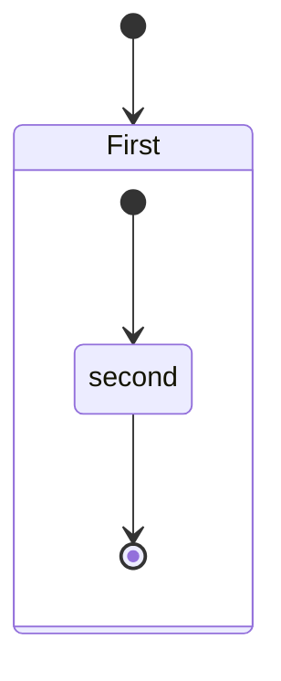

```python
def fun():
    pass
    return 0
```
[gg]: https://translate.google.cn	""Gooooooooooogle""
[rb]:http://www.runoob.com	"optional title"
like ~~this~~

- [x] @mentions, #refs, [links](), **formatting**, and <del>tags</del> supported
- [x] list syntax required (any unordered or ordered list supported)
- [x] this is a complete item
- [ ] this is an incomplete item

## *This text will[^1] be italic*

```Shell
echo $path
echo $?
```

[^1]: 这是脚注标注尾注

**This text will be italic**

https://news.sina.com.cn
<https://news.sina.com.cn>
URL var [Google][gg]

URL var [Runoob][rb]

__This text will be italic__


<p style="border:1px #666 solid;width:320px;text-align:center;border-radius:10px;line-height:16px;margin-left:auto;margin-right:auto;">
Hello, CSS<br />
Hello, Markdown<br />
Hello, HTML<br />
    Hello, PDF<br />
    Hello, pandoc<br />
</p>


***You can combine them***

___You can combine them___

| First Header | Second Header |
| -: | :-: |
|item<sup>2</sup> | Content from `print('Hello, world!')`cell 2 |
|item<sub>3</sub> | Content in the @JackMa column |
link to [www.bing.com](image.bing.com)

https://pages.github.com

\*\_This text will be italic\_\*
\*This text will be italic\*

质能守恒方程可以用一个很

简洁的方程式 <kbd>Ctrl</kbd> + <kbd>Alt</kbd> + <kbd>Del</kbd> 来表达。

 - item1
 - item2
  - item21
  - item 22


$$
\documentclass{article}
\begin{document}
Hello, world!
\end{document}
$$

*Italic*
<a href="https://www.baidu.com/">active tublr</a>
**Bold**
***Italic & Bold***


LINKS: [百度](https://www.baidu.com)   <a href="https://www.163.com">网易</a>
:grin:

:dash:

:clap:

